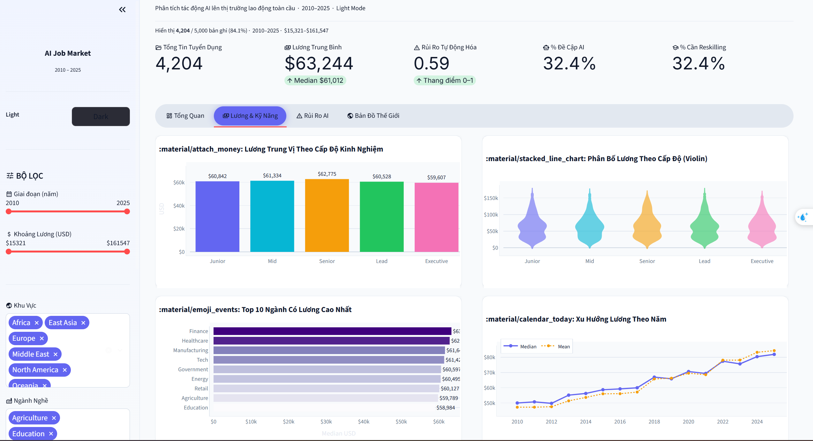
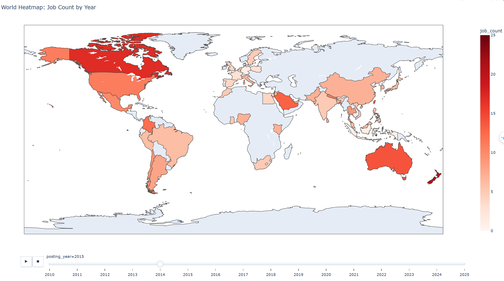
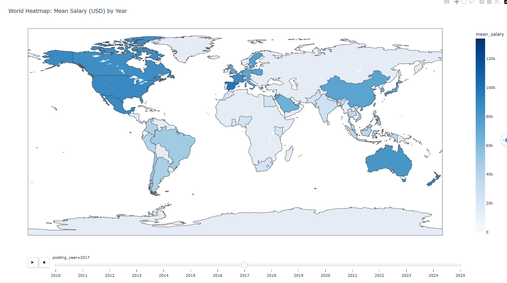

# AI Impact on Job Market — Interactive Dashboard 🚀

> Phân tích toàn diện tác động của trí tuệ nhân tạo (AI) lên thị trường lao động toàn cầu giai đoạn **2010–2025** thông qua Dashboard Streamlit tương tác chuyên nghiệp.


---

## 📋 Mục lục

1. [Giới thiệu](#giới-thiệu)
2. [Tính năng nổi bật](#tính-năng-nổi-bật)
3. [Cấu trúc dự án](#cấu-trúc-dự-án)
4. [Cài đặt & Chạy dự án](#cài-đặt--chạy-dự-án)
5. [Tạo dữ liệu mẫu](#tạo-dữ-liệu-mẫu)
6. [Cấu trúc Dashboard](#cấu-trúc-dashboard)

---

## Giới thiệu

Dự án sử dụng bộ dữ liệu tuyển dụng đa quốc gia giai đoạn **2010–2025** để trả lời các câu hỏi chiến lược:

- Thị trường lao động thay đổi như thế nào dưới tác động của AI?
- Ngành nghề nào có rủi ro tự động hóa cao nhất?
- Kỹ năng nào đang được ưu tiên và xu hướng lương biến động ra sao?
- Các quốc gia đang phản ứng thế nào với làn sóng AI?

Kết quả được trình bày trực quan thông qua **hơn 12 biểu đồ tương tác**, **bản đồ thế giới (Choropleth)** và hệ thống **KPI động** trên nền tảng Web App Streamlit.

---

## Tính năng nổi bật

- 🌗 **Light / Dark Mode Native**: Giao diện (UI) hỗ trợ chuyển đổi Light/Dark mode linh hoạt trực tiếp từ Sidebar với bộ CSS tuỳ chỉnh sâu (Glassmorphism, Neon/Clean UI).
- 🎛️ **Bộ Lọc Động (Dynamic Filters)**: Lọc dữ liệu real-time theo Năm, Khoảng lương, Khu vực, Ngành nghề, Mức độ áp dụng AI, và Cấp độ kinh nghiệm.
- 🌍 **Bản đồ Thế Giới (Map)**: Trực quan hoá dữ liệu không gian bằng Plotly Geo, hiển thị mật độ tin tuyển dụng và cường độ AI theo quốc gia.
- 🎨 **Material Symbols**: Sử dụng bộ icon tiêu chuẩn Google Material Design, chuyên nghiệp và tối giản.
- 📊 **Tối Ưu Hoá Layout**: Bố cục Dashboard rộng (Wide Mode) tận dụng tối đa không gian hiển thị cho các biểu đồ phân tích.

---

## Cấu trúc dự án

```text
📁 data_visualization/
├── 📄 dashboard.py              # Entry point của Streamlit App
├── 📄 generate_mock_data.py     
├── 📁 data/
│   └── ai_job_market_mock.csv   # Dataset sử dụng cho Dashboard
├── 📁 src/
│   └── 📁 dashboard/            # Logic và giao diện của các thẻ (Tabs)
│       ├── kpis.py              # Hiển thị các chỉ số tổng quan (KPIs)
│       ├── styles.py            # CSS cấu hình Light/Dark Mode (Theme)
│       ├── tab_map.py           # Phân tích theo Bản đồ quốc gia
│       ├── tab_overview.py      # Phân tích tổng quan (Overview)
│       ├── tab_risk.py          # Phân tích rủi ro tự động hoá
│       └── tab_salary.py        # Phân tích Mức lương & Kỹ năng
├── 📄 requirements.txt          # Danh sách thư viện Python
└── 📄 README.md                 # Tài liệu hướng dẫn
```

---

## Cài đặt & Chạy dự án

**1. Clone dự án và cài đặt môi trường ảo (khuyến nghị)**

```bash
python -m venv venv
# Windows:
venv\Scripts\activate
# macOS/Linux:
source venv/bin/activate
```

**2. Cài đặt thư viện phụ thuộc**

```bash
pip install -r requirements.txt
```
*(Yêu cầu cài đặt `streamlit`, `pandas`, `plotly`)*

**3. Chạy Dashboard**

```bash
python -m streamlit run dashboard.py
```

Dashboard sẽ được tự động mở trên trình duyệt tại địa chỉ: `http://localhost:8501`.

---

## Tạo dữ liệu mẫu

Nếu bạn chưa có tệp `data/ai_job_market_mock.csv`, bạn có thể tự tạo bộ dữ liệu giả lập chuẩn xác bằng lệnh:

```bash
python generate_mock_data.py
```
Script này sẽ tạo ra 10.000 bản ghi phân bổ hợp lý theo xu hướng tăng trưởng AI, lạm phát lương, và rủi ro tự động hoá theo ngành nghề.

---

## Cấu trúc Dashboard

Dashboard được chia thành 4 thẻ (Tabs) chính:

1. **Tổng Quan**: Hiển thị xu hướng tuyển dụng qua các năm, tỷ lệ đề cập đến AI, và các ngành nghề/quốc gia dẫn đầu.
2. **Lương & Kỹ Năng**: Phân tích chuyên sâu về mức lương trung vị theo cấp độ kinh nghiệm, xu hướng lạm phát lương, và các kỹ năng cốt lõi được nhà tuyển dụng săn đón.
3. **Rủi Ro AI**: Đánh giá chỉ số rủi ro tự động hoá (Automation Risk), phân tích mối quan hệ giữa rủi ro và mức lương, và tỷ lệ yêu cầu đào tạo lại (Reskilling).
4. **Bản Đồ Thế Giới**: Hai bản đồ thế giới tương tác (Choropleth) hiển thị mật độ tin tuyển dụng và cường độ AI trải khắp toàn cầu.

---

## 📸 Hình ảnh Dashboard (Screenshots)

Dưới đây là hình ảnh thực tế của hệ thống phân tích:

### 1. Giao Diện Tổng Quan (Overview)


### 2. Bản Đồ Phân Bố Việc Làm (World Count Job)


### 3. Bản Đồ Mức Lương (World Salary)


---
