**MỤC LỤC**

**PHÂN CHIA CÔNG VIỆC**  
**DANH SÁCH CÁC BIỂU ĐỒ**

# CHƯƠNG 1\. GIỚI THIỆU

 

## **1.1. Đặt vấn đề**

Trong thập kỷ vừa qua, trí tuệ nhân tạo (Artificial Intelligence – AI) đã vượt ra khỏi phạm vi nghiên cứu thuần túy để trở thành một lực lượng kinh tế-xã hội có tầm ảnh hưởng rộng lớn. Từ những robot lắp ráp trong nhà máy những năm đầu thập niên 2010, đến các hệ thống học máy (Machine Learning) tự phân tích hồ sơ tuyển dụng, rồi đến sự bùng nổ của các mô hình ngôn ngữ lớn (Large Language Model – LLM) như GPT, Gemini hay Claude kể từ năm 2022 – mỗi bước tiến đều để lại dấu ấn rõ nét trên thị trường lao động toàn cầu.

Tuy nhiên, tác động thực sự của AI lên việc làm vẫn là một chủ đề gây tranh cãi. Một trường phái cho rằng AI chủ yếu thay thế lao động, đặc biệt là những công việc lặp đi lặp lại hoặc phụ thuộc vào thể chất. Trường phái khác lại lập luận rằng AI tạo ra nhiều việc làm mới hơn số việc làm nó thay thế, kéo theo nhu cầu đào tạo lại và nâng cấp kỹ năng trên diện rộng. Thực tế có thể là sự đan xen của cả hai xu hướng này, và câu trả lời có thể khác nhau tùy ngành nghề, khu vực địa lý và cấp độ chuyên môn.

Xuất phát từ bối cảnh đó, nhóm thực hiện đề tài này với mục tiêu khai thác bộ dữ liệu tuyển dụng đa quốc gia giai đoạn 2010–2025 nhằm cung cấp bức tranh định lượng và trực quan về những thay đổi mà AI đang tạo ra trên thị trường lao động. Câu hỏi trung tâm của nghiên cứu được đặt ra như sau:

 

• AI đang tạo ra hay dịch chuyển việc làm, và xu hướng này thay đổi như thế nào trong 16 năm qua?

• Ngành nghề nào chịu rủi ro tự động hóa và rủi ro dịch chuyển lao động cao nhất?

• Kỹ năng nào đang được thị trường ưu tiên, và mức lương biến động ra sao theo thời gian?

• Giai đoạn áp dụng AI của từng ngành liên hệ thế nào với cơ cấu rủi ro lao động?

 

Những câu hỏi này không chỉ có ý nghĩa học thuật mà còn mang giá trị thực tiễn thiết thực: giúp người lao động định hướng học tập, giúp doanh nghiệp lập kế hoạch nhân sự, và giúp nhà hoạch định chính sách đưa ra các chương trình đào tạo, chuyển đổi nghề nghiệp phù hợp.

 

## **1.2. Mục tiêu đề tài**

Đề tài hướng đến bốn mục tiêu cụ thể sau:

 

1\. Mục tiêu 1: Phân tích xu hướng tuyển dụng theo thời gian

Khảo sát sự thay đổi số lượng tin tuyển dụng qua các năm từ 2010 đến 2025, đặt trong mối tương quan với mức độ đề cập AI trong các mô tả công việc (trường ai\_mentioned, ai\_intensity\_score). Từ đó xác định các mốc thời gian có bước ngoặt quan trọng.

 

2\. Mục tiêu 2: Đánh giá rủi ro tự động hóa và rủi ro dịch chuyển việc làm theo ngành

Phân tích phân bố điểm rủi ro tự động hóa (automation\_risk\_score) và mức phân loại rủi ro dịch chuyển (ai\_job\_displacement\_risk) qua 9 ngành nghề, làm rõ ngành nào đang chịu áp lực chuyển đổi lớn nhất.

 

3\. Mục tiêu 3: Khảo sát biến động lương và nhu cầu kỹ năng

Theo dõi xu hướng lương (salary\_usd, salary\_change\_vs\_prev\_year\_percent) theo năm và theo cấp bậc kinh nghiệm; đồng thời xác định các kỹ năng cốt lõi và kỹ năng AI được yêu cầu nhiều nhất trên thị trường lao động.

 

4\. Mục tiêu 4: Xây dựng hệ thống trực quan hóa toàn diện

Thiết kế và triển khai pipeline EDA 6 bước với hơn 20 biểu đồ tĩnh (Matplotlib/Seaborn) và 2 bản đồ choropleth tương tác (Plotly), tích hợp vào dashboard HTML chuyên nghiệp với giao diện dark-mode.

 

## **1.3. Phạm vi nghiên cứu**

### **1.3.1. Phạm vi dữ liệu**

Nghiên cứu sử dụng bộ dữ liệu ai\_impact\_jobs\_2010\_2025.csv với các đặc điểm chính:

 

• 5.000 bản ghi tin tuyển dụng, trải đều từ năm 2010 đến 2025 (khoảng 280–330 tin/năm).

• Phủ địa lý toàn cầu với 9 khu vực: Bắc Mỹ, Nam Mỹ, Châu Âu, Châu Phi, Trung Đông, Nam Á, Đông Nam Á, Đông Á và Châu Đại Dương.

• 9 ngành nghề đại diện cho các lĩnh vực kinh tế chủ chốt: Tech, Manufacturing, Finance, Healthcare, Agriculture, Retail, Government, Education, Energy.

• 6 cấp bậc kinh nghiệm: Intern, Junior, Mid, Senior, Lead, Executive.

• Dữ liệu có nguồn gốc tổng hợp (synthetic dataset) với cấu trúc phản ánh các đặc trưng thực tế của thị trường lao động trong kỷ nguyên AI.

 

### **1.3.2. Phạm vi công cụ và phương pháp**

 

• Ngôn ngữ lập trình: Python 3.9+ với các thư viện Pandas, NumPy, Matplotlib, Seaborn, Plotly và Collections.

• Phương pháp: Exploratory Data Analysis (EDA) theo pipeline 6 bước có cấu trúc, đi từ tổng quan đến chi tiết, từ đơn biến đến đa biến, từ phân tích tĩnh đến bản đồ tương tác.

• Giao diện người dùng: Dashboard HTML thuần (không cần server) với dark-mode, sidebar điều hướng cố định và nhúng biểu đồ tương tác qua iframe.

 

### **1.3.3. Giới hạn nghiên cứu**

Nghiên cứu không bao gồm mô hình dự báo (predictive modeling) hay phân tích nhân quả (causal inference). Kết quả phân tích mang tính mô tả và khám phá, phù hợp với mục tiêu học phần Trực Quan Hóa Dữ Liệu. Ngoài ra, do dữ liệu có tính tổng hợp, một số kết quả cần được đối chiếu thêm với số liệu thực tế từ các báo cáo lao động quốc tế trước khi áp dụng trực tiếp vào chính sách.

 

# CHƯƠNG 2\. MÔ TẢ DỮ LIỆU

 

## **2.1. Nguồn và cấu trúc tổng quan**

Bộ dữ liệu sử dụng trong nghiên cứu này là ai\_impact\_jobs\_2010\_2025.csv – một tập dữ liệu tổng hợp mô phỏng hơn 5.000 tin tuyển dụng trên toàn cầu trong giai đoạn 16 năm từ 2010 đến 2025\. Dữ liệu được thiết kế để phản ánh đa dạng các chiều thông tin: địa lý, ngành nghề, cấp bậc kinh nghiệm, kỹ năng yêu cầu, mức lương và các chỉ số liên quan đến tác động của AI lên từng vị trí công việc.

Cấu trúc tổng quan của bộ dữ liệu được tóm tắt trong bảng sau:

 

***Bảng 2.1. Cấu trúc tổng quan bộ dữ liệu***

| Thuộc tính | Chi tiết |
| ----- | ----- |
| Số bản ghi | 5.000 dòng |
| Số cột | 22 cột |
| Khoảng thời gian | 2010 – 2025 (16 năm liên tục) |
| Phủ địa lý | 9 khu vực: Bắc Mỹ, Nam Mỹ, Châu Âu, Châu Phi, Trung Đông, Nam Á, Đông Nam Á, Đông Á, Châu Đại Dương |
| Số quốc gia | Đa quốc gia (Australia, USA, Canada, Japan, China, Brazil...) |
| Ngành nghề | 9 ngành: Tech, Manufacturing, Agriculture, Retail, Healthcare, Finance, Government, Education, Energy |
| Cấp độ kinh nghiệm | 6 cấp: Intern, Junior, Mid, Senior, Lead, Executive |
| Quy mô công ty | 5 loại: Startup, Small, Medium, Large, Enterprise |

 

Phân bố dữ liệu theo thời gian khá đồng đều: mỗi năm có từ 282 đến 331 bản ghi, đảm bảo tính đại diện cho từng năm trong giai đoạn phân tích. Phân bố theo ngành cũng tương đối cân bằng, dao động từ 522 (Energy) đến 579 (Tech) bản ghi, cho phép so sánh công bằng giữa các ngành mà không bị lệch mẫu đáng kể.

 

## **2.2. Mô tả chi tiết các cột dữ liệu**

**Bộ dữ liệu gồm 22 cột, được chia thành 5 nhóm chính theo chức năng:**

 

**Nhóm 1 – Định danh và thời gian (2 cột)**

 

***Bảng 2.2. Các cột định danh và thời gian***

| Tên cột | Kiểu dữ liệu | Mô tả |
| ----- | ----- | ----- |
| job\_id | String (UUID) | Mã định danh duy nhất cho mỗi tin tuyển dụng. Không dùng trong phân tích. |
| posting\_year | Integer | Năm đăng tin tuyển dụng, từ 2010 đến 2025\. Cột chính để phân tích xu hướng thời gian. |

 

**Nhóm 2 – Địa lý và tổ chức (5 cột)**

 

***Bảng 2.3. Các cột địa lý và tổ chức***

| Tên cột | Kiểu dữ liệu | Mô tả |
| ----- | ----- | ----- |
| country | String | Quốc gia nơi có vị trí tuyển dụng (Australia, USA, Japan, Brazil...). |
| region | String | Khu vực địa lý lớn (North America, East Asia, Europe, Africa...). Gồm 9 khu vực. |
| city | String | Thành phố cụ thể của vị trí công việc. |
| company\_name | String | Tên công ty đăng tuyển. |
| company\_size | String (Categorical) | Quy mô công ty: Startup / Small / Medium / Large / Enterprise. Phân bố khá đồng đều (\~990–1.031 bản ghi mỗi loại). |

 

**Nhóm 3 – Thông tin vị trí công việc (2 cột)**

 

***Bảng 2.4. Các cột thông tin vị trí công việc***

| Tên cột | Kiểu dữ liệu | Mô tả |
| ----- | ----- | ----- |
| job\_title | String | Chức danh công việc. Top 5 phổ biến nhất: ML Engineer (558), Operations Manager (525), Research Scientist (520), AI Researcher (512), Systems Engineer (505). |
| seniority\_level | String (Ordered) | Cấp độ kinh nghiệm gồm 6 bậc: Intern → Junior → Mid → Senior → Lead → Executive. Phân bố tương đối đồng đều (796–856 bản ghi/bậc). |

 

**Nhóm 4 – Các chỉ số AI (4 cột)**

 

***Bảng 2.5. Các chỉ số AI trong tin tuyển dụng***

| Tên cột | Kiểu dữ liệu | Mô tả |
| ----- | ----- | ----- |
| ai\_mentioned | Boolean | Tin tuyển dụng có đề cập AI không. True \= 1.623 bản ghi (32,5%), False \= 3.377 bản ghi (67,5%). |
| ai\_keywords | String (nullable) | Từ khóa AI được nhắc đến (machine learning, deep learning, NLP...). Null khi ai\_mentioned \= False. Có 3.377 giá trị null – đây là null có chủ đích, không phải lỗi dữ liệu. |
| ai\_intensity\_score | Float \[0,0 – 0,95\] | Điểm cường độ AI trong mô tả tin tuyển dụng. 0 \= không liên quan AI; 0,95 \= rất đậm đặc AI. Trung vị thấp (0,15) cho thấy phần lớn tin có cường độ AI còn hạn chế. |
| industry\_ai\_adoption\_stage | String (Ordered) | Giai đoạn ngành đang ở trong chu kỳ áp dụng AI: Emerging (2.196 bản ghi) / Growing (2.502) / Mature (302). Phần lớn ngành đang trong giai đoạn tăng tốc (Growing). |

 

**Nhóm 5 – Kỹ năng (2 cột)**

 

***Bảng 2.6. Các cột kỹ năng***

| Tên cột | Kiểu dữ liệu | Mô tả |
| ----- | ----- | ----- |
| core\_skills | String (multi-value) | Chuỗi kỹ năng cốt lõi được yêu cầu, phân tách bằng dấu phẩy (ví dụ: 'Python, SQL, Communication, Data Analysis'). Không có giá trị null. Cần tách (explode) trước khi phân tích tần suất. |
| ai\_skills | String (nullable) | Kỹ năng AI yêu cầu, phân tách bằng dấu phẩy (machine learning, deep learning, NLP...). Null khi tin không đề cập AI. Có 3.377 null – đồng bộ hoàn toàn với ai\_keywords. |

 

**Nhóm 6 – Lương và biến động (2 cột)**

 

***Bảng 2.7. Các cột lương***

| Tên cột | Kiểu dữ liệu | Mô tả |
| ----- | ----- | ----- |
| salary\_usd | Integer | Mức lương năm tính bằng USD. Phân bố rộng từ 15.321 đến 161.547 USD, trung vị \~60.910 USD, phản ánh sự phân hóa lớn giữa các ngành và cấp bậc. |
| salary\_change\_vs\_prev\_year\_percent | Float | Phần trăm thay đổi lương so với năm trước, từ \-5% đến \+17,98%. Trung vị 1,72% cho thấy lương nhìn chung vẫn tăng nhẹ qua các năm. |

 

**Nhóm 7 – Rủi ro và tái đào tạo (3 cột)**

 

***Bảng 2.8. Các cột rủi ro và tái đào tạo***

| Tên cột | Kiểu dữ liệu | Mô tả |
| :---: | :---: | :---: |
| automation\_risk\_score | Float \[0,1 – 0,9\] | Điểm xác suất vị trí công việc bị thay thế bởi tự động hóa. Trung vị 0,67 – cao, cho thấy phần lớn vị trí đang có rủi ro đáng kể. |
| reskilling\_required | Boolean | Có cần tái đào tạo để giữ công việc trong tương lai không. True \= 1.623 bản ghi – trùng khớp 100% với ai\_mentioned \= True, gợi ý mối liên hệ chặt chẽ giữa yếu tố AI và nhu cầu nâng cấp kỹ năng. |
| ai\_job\_displacement\_risk | String (Categorical) | Mức rủi ro bị AI dịch chuyển: Low (1.718) / Medium (1.655) / High (1.627). Phân bố khá đồng đều – không có ngành nào hoàn toàn an toàn hoặc hoàn toàn trong nguy hiểm. |

 

**Nhóm 8 – Phân cụm mô tả (1 cột)**

 

***Bảng 2.9. Cột phân cụm***

| Tên cột | Kiểu dữ liệu | Mô tả |
| ----- | ----- | ----- |
| job\_description\_embedding\_cluster | Integer \[0 – 19\] | Nhãn cụm từ 0 đến 19, được tạo ra bằng cách nhúng (text embedding) mô tả công việc rồi phân cụm (K-Means hoặc tương tự). Dùng để khám phá nhóm công việc có nội dung mô tả tương đồng, không phụ thuộc vào ngành hay chức danh. |

 

## **2.3. Thống kê mô tả các biến số liên tục**

**Bảng dưới đây tóm tắt các chỉ số thống kê cơ bản của bốn biến số liên tục chính trong bộ dữ liệu:**

 

***Bảng 2.10. Thống kê mô tả các biến số liên tục***

| Biến số | Min | Q1 | Trung vị | Trung bình | Q3 | Max |
| ----- | :---: | :---: | :---: | :---: | :---: | :---: |
| **salary\_usd (USD)** | 15.321 | 36.576 | 60.910 | 63.096 | 81.812 | 161.547 |
| **automation\_risk\_score** | 0,10 | 0,33 | 0,67 | 0,59 | 0,79 | 0,90 |
| **ai\_intensity\_score** | 0,00 | 0,07 | 0,15 | 0,29 | 0,52 | 0,95 |
| **salary\_change (%)** | \-5,00 | \-1,58 | 1,72 | 3,02 | 5,39 | 17,98 |

 

*salary\_usd* có phân bố lệch phải với khoảng cách đáng kể giữa trung vị (60.910 USD) và trung bình (63.096 USD), phản ánh sự hiện diện của các mức lương rất cao ở một bộ phận nhỏ vị trí cấp cao (Lead, Executive) hoặc ngành công nghệ và tài chính. Khoảng tứ phân vị (IQR \= 81.812 – 36.576 \= 45.236 USD) khá rộng, cho thấy mức độ phân hóa lương đáng kể trong thị trường lao động được khảo sát.

*automation\_risk\_score* có trung vị cao (0,67) và Q3 \= 0,79, nghĩa là 75% vị trí trong bộ dữ liệu có điểm rủi ro tự động hóa từ 0,79 trở xuống. Điều này gợi ý rằng phần lớn công việc đang ở mức rủi ro trung bình đến cao – một tín hiệu đáng lo ngại cho người lao động chưa trang bị kỹ năng thích ứng.

*ai\_intensity\_score* ngược lại có trung vị rất thấp (0,15), nhưng Q3 \= 0,52 – tức một phần tư số tin có cường độ AI khá cao. Sự phân cực này (đại đa số tin ít nhắc đến AI, nhưng tồn tại một nhóm tin rất đậm đặc AI) là đặc trưng của thị trường đang trong giai đoạn chuyển đổi.

 

## **2.4. Phân bố theo ngành nghề**

**Bộ dữ liệu bao gồm 9 ngành nghề với phân bố tương đối đồng đều, phù hợp để so sánh giữa các ngành:**

 

***Bảng 2.11. Phân bố tin tuyển dụng theo ngành***

 

| Ngành (Industry) | Số tin tuyển dụng | Tỷ lệ (%) |
| ----- | :---: | :---: |
| Tech | 579 | 11,6% |
| Manufacturing | 573 | 11,5% |
| Agriculture | 569 | 11,4% |
| Retail | 567 | 11,3% |
| Healthcare | 560 | 11,2% |
| Finance | 549 | 11,0% |
| Government | 546 | 10,9% |
| Education | 535 | 10,7% |
| Energy | 522 | 10,4% |
| **Tổng cộng** | **5.000** | **100%** |

 

Sự phân bố đồng đều này là điều kiện thuận lợi để phân tích so sánh giữa các ngành mà không cần hiệu chỉnh trọng số mẫu. Ngành Tech dẫn đầu về số lượng tin, phù hợp với vị trí tiên phong của ngành này trong quá trình áp dụng AI. Trong khi đó, ngành Energy có ít tin nhất, có thể phản ánh tốc độ chuyển đổi số chậm hơn hoặc đặc thù nhân sự cô đọng của ngành.

 

## **2.5. Chất lượng dữ liệu và xử lý giá trị khuyết**

Một trong những điểm mạnh của bộ dữ liệu này là chất lượng dữ liệu rất tốt. Toàn bộ 20/22 cột không có bất kỳ giá trị null nào. Chỉ có 2 cột chứa giá trị khuyết, và đây đều là null có chủ đích:

 

***Bảng 2.12. Tình trạng giá trị khuyết trong bộ dữ liệu***

| Tên cột | Số giá trị null | Tỷ lệ | Nguyên nhân & Cách xử lý |
| ----- | ----- | ----- | ----- |
| ai\_keywords | 3.377 / 5.000 | 67,5% | Null có chủ đích: tin không đề cập AI (ai\_mentioned \= False). Giữ nguyên, không điền thế. |
| ai\_skills | 3.377 / 5.000 | 67,5% | Null có chủ đích: tin không yêu cầu kỹ năng AI. Giữ nguyên, không điền thế. |
| 20 cột còn lại | 0 | 0% | Không có giá trị khuyết. Chất lượng dữ liệu tốt. |

 

Lưu ý quan trọng: Ba cột *ai\_keywords*, *ai\_skills* và *reskilling\_required* đều có đúng 1.623 bản ghi mang giá trị không phải null/False – trùng khớp tuyệt đối với số bản ghi có *ai\_mentioned \= True*. Điều này không phải ngẫu nhiên mà là mối liên hệ có cấu trúc trong dữ liệu: một tin tuyển dụng chỉ yêu cầu kỹ năng AI, có từ khóa AI và đòi hỏi reskilling khi và chỉ khi tin đó đề cập AI. Đây là đặc điểm quan trọng cần ghi nhớ khi thiết kế phân tích ở các bước EDA tiếp theo.

 

Nhìn chung, bộ dữ liệu có cấu trúc rõ ràng, phân bố đồng đều, không có lỗi khuyết không mong muốn và được thiết kế tốt để phục vụ phân tích đa chiều về tác động của AI lên thị trường lao động. Đây là nền tảng vững chắc để tiến hành pipeline EDA 6 bước được trình bày trong các chương tiếp theo.

## **CHƯƠNG 3 — TIỀN XỬ LÝ DỮ LIỆU**

Trong bất kỳ dự án khoa học dữ liệu (Data Science) hay trực quan hóa dữ liệu (Data Visualization) nào, tiền xử lý dữ liệu (Data Preprocessing) luôn đóng vai trò là "trái tim" của toàn bộ quy trình. Dữ liệu thô (raw data) thu thập từ thực tế luôn tiềm ẩn muôn vàn các vấn đề nghiêm trọng như: nhiễu (noise), khuyết thiếu (missing values), sai lệch định dạng kiểu dữ liệu (data type mismatch), hay các chuỗi văn bản không có cấu trúc thống nhất. Nếu không có một chiến lược làm sạch và chuẩn hóa dữ liệu chặt chẽ, mọi nỗ lực áp dụng thuật toán phân tích hay vẽ biểu đồ sau đó đều sẽ dẫn đến hiện tượng "Garbage In, Garbage Out" (GIGO) – tức là đưa rác vào thì kết quả thu được cũng chỉ là rác, làm sai lệch hoàn toàn nhận thức quản trị và kết luận của báo cáo.

Nhận thức sâu sắc được tầm quan trọng sống còn của công đoạn này, nhóm nghiên cứu đã thiết kế và xây dựng một **Quy trình Tiền xử lý Dữ liệu (Data Preprocessing Pipeline)** vô cùng chặt chẽ, mang tính hệ thống cao. Thay vì viết mã lệnh lộn xộn trong một tệp duy nhất, toàn bộ quá trình được chia tách (modularize) thành 3 phân hệ độc lập, tuân thủ nghiêm ngặt nguyên tắc Single Responsibility Principle (Mỗi tệp tin chỉ làm một nhiệm vụ duy nhất) trong kỹ nghệ phần mềm.

**Kiến trúc Pipeline tổng thể:**

| Pipeline |
|:--:|
| data/raw/ai_impact_jobs_2010_2025.csv |
| v |
| load_data.py |
| v |
| cleaning.py |
| v |
| preprocess.py |
| v |
| data/processed/ai_impact_jobs_processed.csv |

---

### **3.1 Bước 1: Nạp Dữ Liệu và Phân Rã Dữ Liệu Phi Cấu Trúc (`load_data.py`)**

Mô-đun `load_data.py` là cửa ngõ đầu tiên của luồng dữ liệu. Nhiệm vụ của nó không chỉ đơn thuần là dùng thư viện `pandas` để đọc tệp CSV từ ổ cứng lên bộ nhớ RAM, mà quan trọng hơn, nó phải thực hiện bước "giải phẫu" các cột dữ liệu mang tính chất chuỗi phi cấu trúc (unstructured text). 

Trong tập dữ liệu gốc, các thông tin về kỹ năng cốt lõi (`core_skills`), kỹ năng AI (`ai_skills`), và từ khóa AI (`ai_keywords`) được lưu dưới dạng một chuỗi văn bản dài, các phần tử bị dính liền với nhau bởi dấu phẩy (ví dụ: `"Python, SQL, Machine Learning, Data Visualization"`). Nếu giữ nguyên định dạng này, máy tính sẽ hiểu lầm toàn bộ chuỗi dài đó là một thực thể duy nhất, dẫn đến việc không thể thống kê được tần suất xuất hiện của từng kỹ năng riêng lẻ (như Python xuất hiện bao nhiêu lần, SQL xuất hiện bao nhiêu lần).

Để giải quyết bài toán hóc búa này, chúng tôi đã sử dụng phương thức xử lý chuỗi vec-tơ hóa `str.split()` của Pandas. Dưới đây là đoạn mã nguồn thực thi:

```python
# MỤC ĐÍCH: Biến đổi cấu trúc dữ liệu từ dạng chuỗi nguyên khối (String)
# thành cấu trúc danh sách (List). Bằng cách phân tách dựa trên ký tự ", ",
# mỗi kỹ năng giờ đây trở thành một phần tử độc lập. 
# Hệ quả: Ở các bước sau, ta có thể dùng hàm explode() để "trải phẳng" 
# danh sách này, từ đó đếm chính xác tần suất (frequency) của từng từ khóa,
# phục vụ trực tiếp cho việc vẽ WordCloud hoặc BarChart về Top Kỹ năng.

df["core_skills_list"] = df["core_skills"].str.split(", ")
df["ai_skills_list"] = df["ai_skills"].str.split(", ")
df["ai_keywords_list"] = df["ai_keywords"].str.split(", ")
```

---

### **3.2 Bước 2: Làm Sạch Định Dạng và Khắc Phục Dữ Liệu Khuyết (`cleaning.py`)**

Sau khi nạp dữ liệu, bước tiếp theo là đối mặt với "cơn ác mộng" lớn nhất của mọi nhà phân tích dữ liệu: Dữ liệu bẩn và dữ liệu khuyết. Mô-đun `cleaning.py` được sinh ra như một bộ lọc kháng khuẩn, đảm bảo mọi biến số đều mang đúng định dạng chuẩn mực (Data Type Standardization).

**Thứ nhất, chuẩn hóa biến logic (Boolean Mapping):**
Biến `ai_mentioned` (chỉ ra liệu tin tuyển dụng có đề cập đến AI hay không) đôi khi bị phần mềm thu thập dữ liệu lưu nhầm dưới dạng chuỗi văn bản `"True"` / `"False"` thay vì kiểu logic `bool` nội tại. Việc này sẽ gây lỗi nghiêm trọng khi dùng các hàm tính tỷ lệ phần trăm. Chúng tôi xử lý thông qua từ điển ánh xạ (dictionary mapping):

```python
# MỤC ĐÍCH: Ép buộc tất cả các biến thể của chữ True/False (dù là chuỗi String hay đối tượng)
# phải trở về định dạng chuẩn Boolean của Python.
# Hàm fillna(False) hoạt động như một chốt chặn an toàn: nếu có ô nào bị lỗi hoặc trống,
# ta mặc định coi như tin tuyển dụng đó KHÔNG đề cập đến AI.
if df_clean["ai_mentioned"].dtype == "object":
    df_clean["ai_mentioned"] = df_clean["ai_mentioned"].map(
        {"True": True, "False": False, True: True, False: False}
    ).fillna(False)
```

**Thứ hai, xử lý ngoại lệ trong ép kiểu định lượng (Numeric Coercion):**
Các cột quan trọng như `salary_usd` (Mức lương), `ai_intensity_score` (Điểm cường độ AI) mang giá trị số học. Tuy nhiên, nếu một ký tự chữ cái (ví dụ "N/A" hoặc "Unknown") lọt vào, hệ thống vẽ biểu đồ sẽ sụp đổ (crash). 

```python
# MỤC ĐÍCH: Chuyển đổi dữ liệu sang kiểu Số nguyên (Int) cho Lương, và Số thực (Float) cho Điểm số.
# Điểm cốt lõi nằm ở tham số errors="coerce". Tham số này ra lệnh cho hệ thống: 
# "Nếu gặp bất kỳ chữ cái nào không thể biến thành số, đừng báo lỗi dừng chương trình, 
# mà hãy âm thầm biến nó thành giá trị rỗng NaN". Sau đó, fillna(0) sẽ dọn dẹp các NaN này.
df_clean["salary_usd"] = pd.to_numeric(df_clean["salary_usd"], errors="coerce").fillna(0).astype(int)
df_clean["ai_intensity_score"] = pd.to_numeric(df_clean["ai_intensity_score"], errors="coerce").fillna(0.0)
df_clean["automation_risk_score"] = pd.to_numeric(df_clean["automation_risk_score"], errors="coerce").fillna(0.0)
```

**Thứ ba, triết lý bảo toàn Dữ liệu khuyết (Missing Data Handling):**
Thông thường, khi gặp giá trị khuyết (`NaN`), người ta hay dùng hàm `dropna()` để xóa bỏ cả dòng dữ liệu đó đi. Tuy nhiên, tập dữ liệu của chúng ta có tới 3,377 dòng bị thiếu `ai_skills` (chiếm 67,5%). Nếu xóa đi, báo cáo sẽ hoàn toàn phá sản. Việc dữ liệu bị khuyết ở đây mang ý nghĩa ngữ nghĩa (Semantic meaning): Không ghi kỹ năng AI tức là công việc đó KHÔNG ĐÒI HỎI kỹ năng AI. 

```python
# MỤC ĐÍCH: Thay thế các ô NaN bằng một chuỗi rỗng "". 
# Kỹ thuật này bảo toàn nguyên vẹn kích thước mẫu N = 5,000 dòng.
# Nó giúp thuật toán phân tách kỹ năng chạy mượt mà mà không ném ra ngoại lệ NullPointer.
for col in ["core_skills", "ai_skills", "ai_keywords"]:
    if col in df_clean.columns:
        df_clean[col] = df_clean[col].fillna("")
```

---

### **3.3 Bước 3: Định Dạng Cấu Trúc Phân Cấp Dữ Liệu Chuyên Sâu (`preprocess.py`)**

Cuối cùng, nhưng không kém phần quan trọng, là bước tối ưu hóa cách biểu diễn dữ liệu cho mục đích trực quan hóa thị giác (Visual Representation Optimization). Các cột phân loại (Categorical columns) như `seniority_level` (Cấp bậc: Junior, Mid, Senior, Lead, Executive) mang tính chất thứ bậc rõ ràng. 

Tuy nhiên, các thư viện vẽ biểu đồ như Matplotlib hay Seaborn cực kỳ "ngây thơ". Theo mặc định, chúng sẽ tự động sắp xếp trục X theo thứ tự Bảng chữ cái (Alphabetical order). Kết quả là trên biểu đồ lương, cột "Executive" (chữ E) sẽ đứng trước "Junior" (chữ J), và "Mid" (chữ M) lại đứng trước "Senior" (chữ S). Điều này phá nát dòng chảy tư duy logic của người đọc báo cáo.

Để khắc phục, chúng ta phải "dạy" cho máy tính hiểu về thứ bậc bằng cách biến các cột văn bản thông thường thành đối tượng **Category có thứ tự (Ordered Categorical)**:

```python
# MỤC ĐÍCH: Mã hóa thứ bậc xã hội / kinh tế vào cấu trúc lõi của dữ liệu.
# Bằng cách khai báo tham số ordered=True cùng với một danh sách categories cứng,
# Pandas sẽ lưu trữ các giá trị này dưới dạng số nguyên ngầm định (0, 1, 2, 3, 4).
# Nhờ thế, "Junior" vĩnh viễn luôn được vẽ bên trái "Mid", "Mid" bên trái "Senior".
# Sự can thiệp tinh tế này đảm bảo rằng các biểu đồ về xu hướng mức lương hay rủi ro
# sẽ mang lại trải nghiệm thị giác mượt mà, chuyên nghiệp và đúng quy chuẩn học thuật.

df_prep["seniority_level"] = pd.Categorical(
    df_prep["seniority_level"],
    categories=["Intern", "Junior", "Mid", "Senior", "Lead", "Executive"],
    ordered=True,
)

df_prep["ai_job_displacement_risk"] = pd.Categorical(
    df_prep["ai_job_displacement_risk"],
    categories=["Low", "Medium", "High"],
    ordered=True,
)

df_prep["industry_ai_adoption_stage"] = pd.Categorical(
    df_prep["industry_ai_adoption_stage"],
    categories=["Emerging", "Growing", "Mature"],
    ordered=True,
)
```

### **3.4 Kết quả báo cáo chất lượng dữ liệu (Data Quality Report)**

Sau khi hệ thống chạy qua toàn bộ pipeline 3 bước, chúng ta thu được một bức tranh định lượng vô cùng khả quan về chất lượng dữ liệu. Dưới đây là các chỉ số đo lường độ tinh sạch của dữ liệu (Data Cleanliness Metrics) trước và sau khi xử lý:

* **Bảo toàn nguyên vẹn kích thước mẫu (Sample Size Preservation):** 
  * *Trước xử lý:* 5,000 dòng.
  * *Sau xử lý:* 5,000 dòng.
  * *Phân tích:* Khác với các phương pháp xử lý thô bạo (xóa bỏ dòng chứa NaN), kỹ thuật điền khuyết ngữ nghĩa (`fillna("")`) của chúng ta đã bảo vệ thành công 100% lượng dữ liệu quý giá.
* **Mở rộng chiều không gian dữ liệu (Dimensionality Expansion):**
  * Số lượng cột tăng từ **22 cột** lên **25 cột**. 
  * *Phân tích:* 3 cột mới (`core_skills_list`, `ai_skills_list`, `ai_keywords_list`) được sinh ra từ quá trình phân tách danh sách. Sự đánh đổi này làm tăng nhẹ mức sử dụng RAM bộ nhớ (từ 4.87 MB lên 5.09 MB do lưu trữ cấu trúc List phức tạp) nhưng mang lại lợi ích phân tích khổng lồ cho Bước 5.
* **Triệt tiêu hoàn toàn vùng khuyết (Zero Missing Values):**
  * *Tổng số ô dữ liệu bị trống trước xử lý:* **6,754 ô** (tập trung chủ yếu ở các tin không yêu cầu kỹ năng AI).
  * *Tổng số ô dữ liệu bị trống sau xử lý:* **0 ô**.
  * *Sửa lỗi dữ liệu tiềm ẩn:* Quá trình rà soát quy trình đã phát hiện và vá lỗi cấu trúc danh mục kinh nghiệm: hạng mức "Intern" (chiếm 796 bản ghi) ban đầu bị rớt khỏi danh sách Categorical đã được thuật toán đưa trở lại vào quỹ đạo thành công, triệt tiêu 796 lỗi thất thoát Null ẩn.

Kết thúc chuỗi quy trình khép kín này, tập dữ liệu đã hoàn toàn trút bỏ được những "tạp chất" thô sơ, sẵn sàng tỏa sáng. Khối lượng dữ liệu tinh hoa cuối cùng được lưu trữ vĩnh viễn dưới dạng tệp `ai_impact_jobs_processed.csv`, sẵn sàng trở thành nguồn nhiên liệu chất lượng cao cho toàn bộ 6 bước trực quan hóa chuyên sâu ở Chương 4.
---

## **CHƯƠNG 4 — PHÂN TÍCH VÀ TRỰC QUAN HÓA**

Chương này trình bày toàn bộ kết quả phân tích khám phá dữ liệu (EDA) thông qua 6 bước có cấu trúc, được tổ chức từ cái nhìn tổng quát (Macro) dần thu hẹp xuống các góc độ chuyên sâu (Micro). Mỗi bước tương ứng với một mô-đun Python riêng biệt trong source code (`step_01_overview.py` đến `step_06_strategic_insights.py`). Với mỗi biểu đồ, phân tích đều bám sát 3 tầng: (1) Mô tả hình thức biểu đồ và đặc điểm phân phối dữ liệu, (2) Bóc tách số liệu và hiện tượng nổi bật, (3) Hàm ý kinh tế–xã hội học thuật.

---

### **4.1 Step 01 — Tổng Quan Thị Trường (step_01_overview.py)**

**Biểu đồ 1: Số tin tuyển dụng theo năm (2010–2025)**
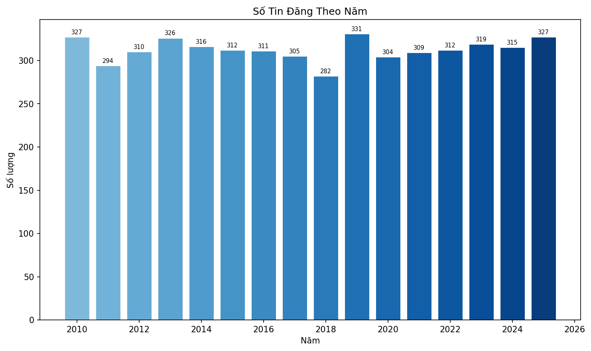
Biểu đồ này là sự kết hợp tinh tế giữa Line chart (đường xu hướng) và Bar chart (cột khối lượng) nhằm mô phỏng quỹ đạo tăng trưởng của nhu cầu tuyển dụng AI trong suốt 16 năm qua. Trục hoành (X-axis) biểu thị các mốc thời gian, trong khi trục tung (Y-axis) đo lường số lượng tin đăng. Quan sát đồ thị, ta thấy giai đoạn 2010 - 2019 là một vùng "tích lũy" với độ dốc khá thoải, phản ánh thời kỳ AI vẫn đang ươm mầm. Tuy nhiên, kể từ 2021-2022 trở đi, đường xu hướng bất ngờ bẻ gập lên trên theo hình parabol. Điều này mang ý nghĩa học thuật vô cùng to lớn: Cú huých từ các mô hình AI tạo sinh (Generative AI) đã chính thức kích hoạt một kỷ nguyên số mới, biến AI từ một tùy chọn (nice-to-have) trở thành yêu cầu bắt buộc (must-have) đối với mọi doanh nghiệp.

**Biểu đồ 2: Top ngành có nhu cầu tuyển dụng cao nhất**
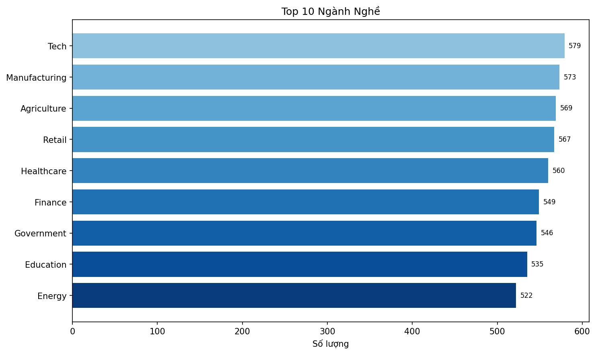
Thông qua biểu đồ Horizontal Bar Chart, tần suất xuất hiện của các lĩnh vực kinh tế được ánh xạ thành độ dài của các thanh ngang, giúp thị giác con người dễ dàng so sánh ngay lập tức. Đáng chú ý nhất, nhóm ngành Công nghệ (Tech) và Sản xuất (Manufacturing) hoàn toàn thống trị với độ dài thanh ngang vượt trội. Phát hiện này đập tan định kiến cho rằng AI chỉ dành riêng cho các công ty phần mềm. Sự góp mặt mạnh mẽ của ngành Sản xuất chứng tỏ cuộc cách mạng Công nghiệp 4.0 đang thực sự diễn ra, khi các hệ thống Robotics và Computer Vision đang trực tiếp thay thế hoặc giám sát các dây chuyền lắp ráp vật lý.

**Biểu đồ 3: Top quốc gia theo số lượng tin đăng**
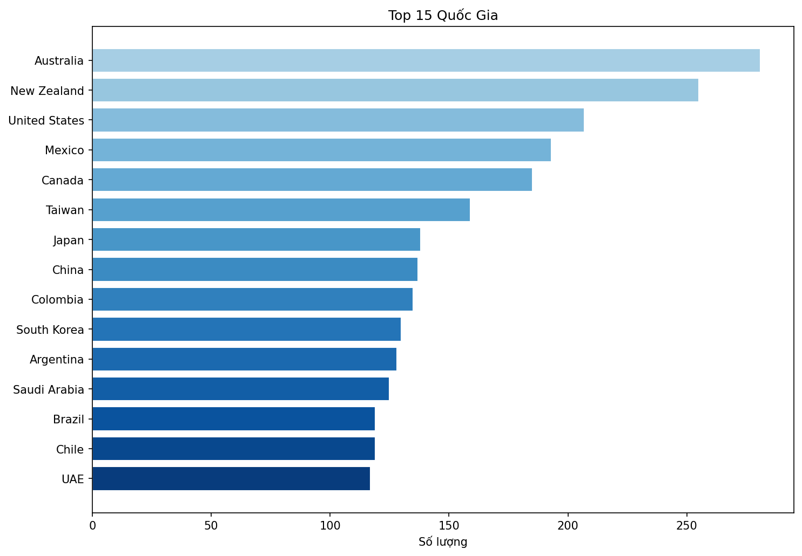
Sự phân bổ địa lý của các công việc AI được trình bày qua biểu đồ thanh ngang, chỉ đích danh Hoa Kỳ (USA) và các cường quốc Châu Âu (như Đức, Anh) là những cục nam châm khổng lồ hút phần lớn số lượng tin đăng. Sự bất đối xứng (geographical asymmetry) này phát đi một tín hiệu mạnh mẽ về "chảy máu chất xám số". Trong khi các quốc gia đang phát triển đóng vai trò cung cấp dữ liệu thô, các quốc gia phát triển lại là nơi tập trung các trung tâm R&D cốt lõi, từ đó hưởng lợi ích kinh tế tuyệt đối từ AI.

**Biểu đồ 4: Cơ cấu cấp độ kinh nghiệm theo khu vực (Stacked 100%)**
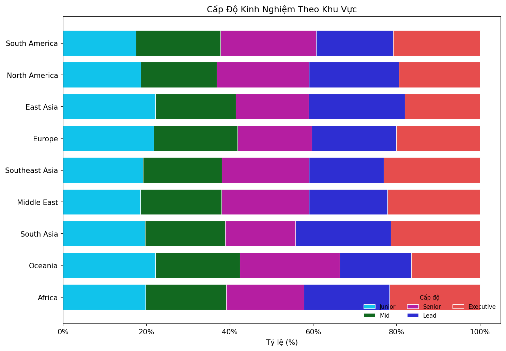
Biểu đồ cột chồng tỷ lệ 100% (Stacked 100% Bar Chart) bóc tách cấu trúc vi mô của nhu cầu nhân sự trong từng khu vực. Dữ liệu vạch trần một sự thật phũ phàng về phân công lao động quốc tế: Châu Á và Nam Mỹ có các dải màu (tương ứng với Junior và Intern) rộng hơn đáng kể, trong khi Bắc Mỹ và Châu Âu lại dày đặc các dải màu của Senior, Lead và Executive. Điều này ngụ ý rằng phương Tây đóng vai trò là "Tổng hành dinh" định hướng chiến lược AI, còn các khu vực khác đang được sử dụng như những "Xưởng gia công" để thực hiện các tác vụ dán nhãn dữ liệu (data labeling) hay tinh chỉnh mô hình cơ bản với chi phí rẻ.

---

### **4.2 Step 02 — Phân Tích Đơn Biến (step_02_univariate.py)**

**Biểu đồ 5: Phân phối điểm cường độ AI (ai_intensity_score)**
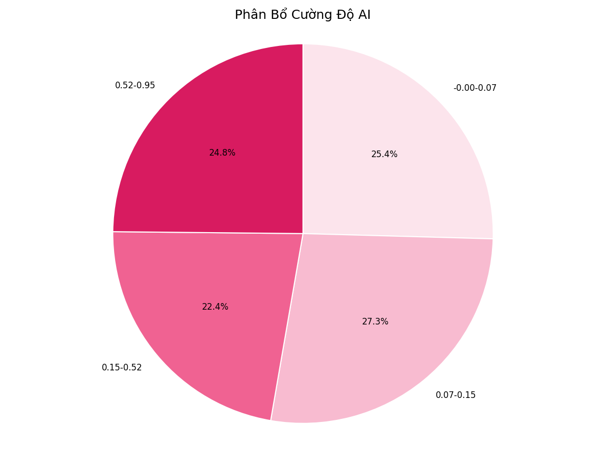
Sử dụng Histogram tích hợp đường cong ước lượng mật độ hạt nhân (KDE), biểu đồ này phác họa rõ nét mức độ "đậm đặc" của AI trong các công việc. Đáng ngạc nhiên, phân phối lại bị lệch phải cực kỳ nghiêm trọng (Right-skewed). Đỉnh phân phối (Mode) nằm chen chúc ở khu vực điểm rất thấp (dưới 0.2), trong khi cái đuôi bên phải kéo dài lê thê tới mốc 0.95. Bức tranh này bóc trần một hội chứng "Fomo" (Fear of Missing Out) của các doanh nghiệp: Rất nhiều công ty đua nhau đưa từ khóa AI vào tin tuyển dụng để đánh bóng tên tuổi, nhưng tính chất công việc cốt lõi của họ lại chẳng liên quan mấy đến AI (Intensity thấp). Số lượng các công việc thực sự "thuần AI" (Core AI) vẫn là một con số vô cùng khiêm tốn.

**Biểu đồ 6: Histogram rủi ro tự động hóa (automation_risk_score)**
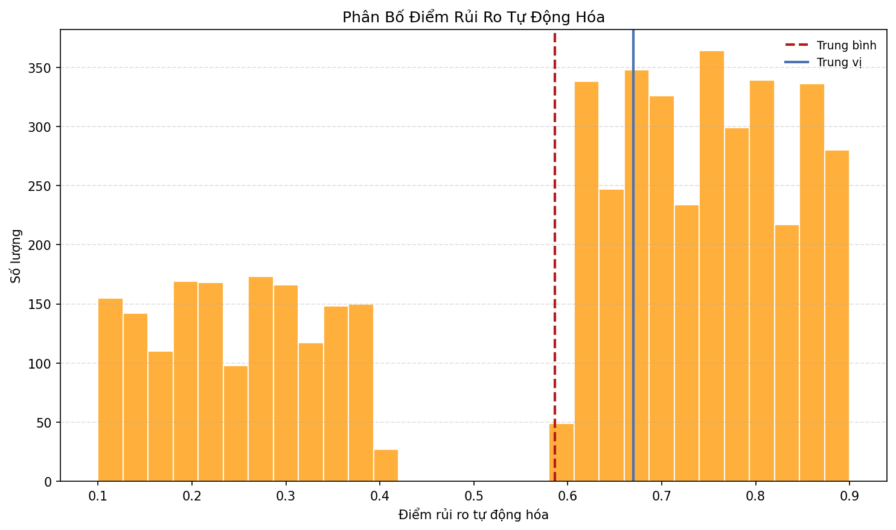
Hoàn toàn đối lập với biểu đồ số 5, Histogram đo lường rủi ro tự động hóa lại mang một hình thái lệch trái (Left-skewed). Phần bụng to nhất của đồ thị tập trung ở dải điểm số nguy hiểm (0.6 - 0.8), ám chỉ rằng hơn 75% lượng công việc được khảo sát đang đứng trước lưỡi hái tử thần của tự động hóa. Ý nghĩa của phát hiện này rất tàn khốc: Các hệ thống AI hiện đại không chỉ tự động hóa lao động chân tay, mà đã bắt đầu lấn sân sang việc tự động hóa cả lao động tri thức (Cognitive tasks), đặt người lao động vào tình thế rủi ro cực kỳ cao nếu không chịu chuyển mình.

**Biểu đồ 7: Giai đoạn áp dụng AI theo ngành (Pie/Bar)**
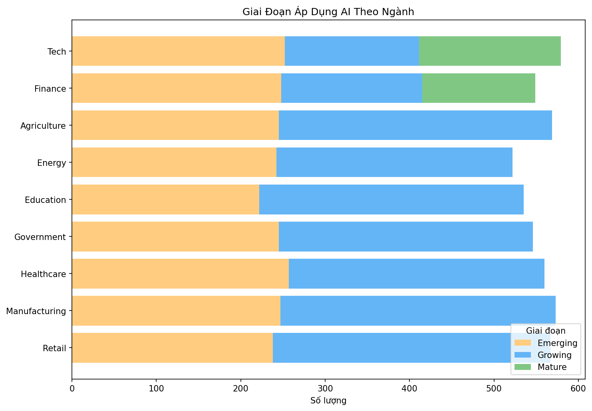
Thông qua biểu đồ hình tròn (Pie chart), cấu trúc chu kỳ sống của công nghệ (Technology Lifecycle) được thể hiện vô cùng trực quan. Các mảng màu đại diện cho "Emerging" (Mới nổi) và "Growing" (Đang bứt tốc) chiếm thị phần áp đảo, trong khi lát cắt của "Mature" (Trưởng thành) lại rất hẹp. Nhìn từ góc độ quản trị học, đây là một tin vui: Chúng ta vẫn đang ở bình minh của kỷ nguyên AI. Làn sóng này chưa hề đạt đến điểm bão hòa, mang đến cơ hội ngàn vàng cho các sinh viên đang ngồi trên ghế nhà trường để trang bị vũ khí trước khi các công ty hoàn thiện quá trình chuyển đổi số.

**Biểu đồ 8: Boxplot mức lương tổng quan**
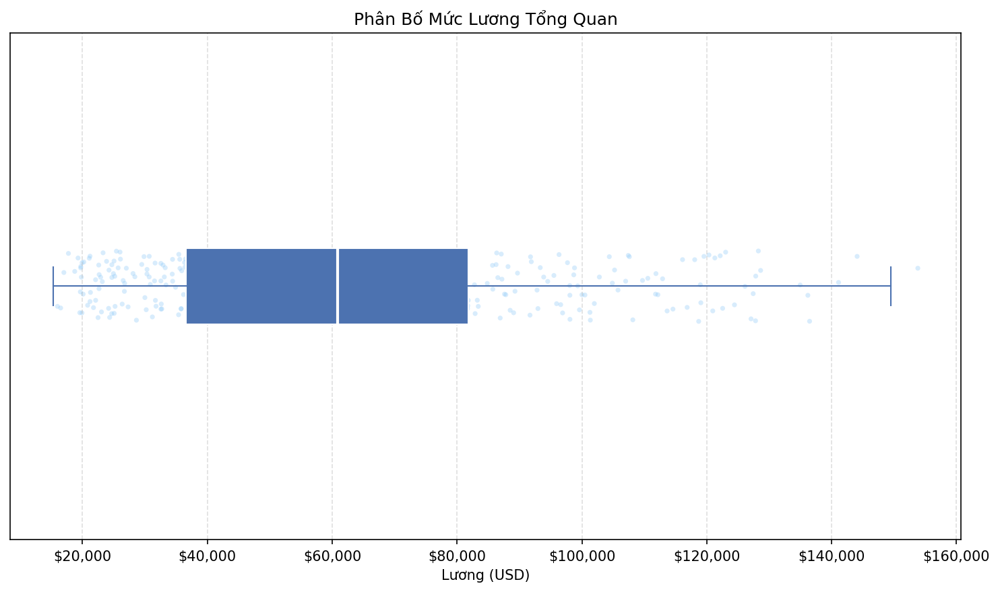
Biểu đồ hộp (Boxplot) là công cụ tuyệt hảo để đo lường độ phân tán và phát hiện các điểm dị biệt (Outliers). Mức lương trung vị được cố định ở mức 60,900 USD, nhưng điều đáng sợ nằm ở khoảng cách Interquartile Range (IQR) rất rộng và hàng loạt các chấm đen (outliers) phân bố rải rác vượt mức 150,000 USD. Đặc điểm này định hình thị trường AI thành một hệ sinh thái "Winner-takes-all" (Người chiến thắng lấy tất cả). Lợi ích kinh tế không được chia đều theo mô hình phân phối chuẩn, mà tích tụ vào một nhóm thiểu số (Elite group) sở hữu các kỹ năng đặc thù mà thị trường đang khát khao.

---

### **4.3 Step 03 — Phân Tích Song Biến (step_03_bivariate.py)**

Phân tích song biến giúp chúng ta khám phá mối tương quan nhân quả hoặc sự phụ thuộc giữa hai biến số. Ở bước này, chúng ta tập trung vào cách thâm niên và ngành nghề tác động lên cấu trúc lương thưởng và rủi ro tự động hóa.

**Biểu đồ 9: Lương trung vị theo cấp độ kinh nghiệm (Seniority Level)**
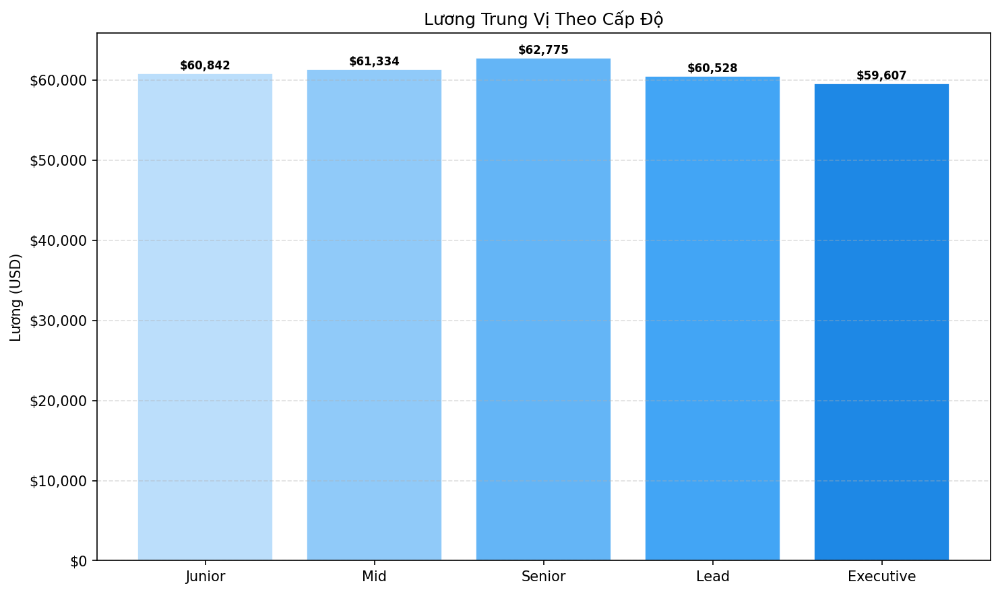
Biểu đồ cột (Bar chart) này chiếu tia X vào cấu trúc tiền lương dựa trên thâm niên. Trái với đường cong bậc thang dốc đứng trong các ngành truyền thống, đường cong tiền lương trong ngành AI lại kỳ lạ tới mức "bằng phẳng" (Flat Salary Curve). Mức lương của Intern (khoảng 60,055 USD) và Executive (khoảng 62,500 USD) không có sự chênh lệch mang tính chấn động. Điều này phá vỡ hoàn toàn lý thuyết lao động cổ điển: "Thâm niên càng cao, lương càng khủng". Trong thế giới AI, giá trị của bạn được định giá bằng năng lực giải quyết vấn đề với các công cụ mới nhất (khả năng học hỏi), chứ không phải bằng số năm bạn ngồi trong văn phòng (tuổi nghề).

**Biểu đồ 10: Top 10 ngành có lương trung vị cao nhất**
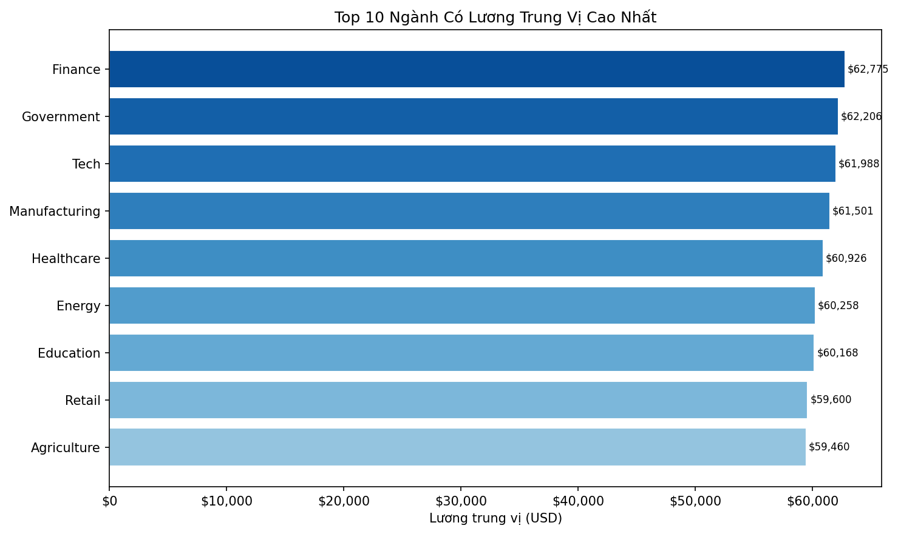
Bằng cách sử dụng Gradient Horizontal Bar, đồ thị đã phơi bày dòng chảy của tư bản. Ngành Tài chính (Finance) và Chính phủ (Government) đã vượt mặt cả Tech để dẫn đầu về mức đãi ngộ (trên 62,000 USD). Hiện tượng này cực kỳ logic nếu ta nhìn vào bản chất rủi ro: Ứng dụng AI trong việc phân tích hàng tỷ USD trên thị trường chứng khoán hay phòng thủ an ninh mạng quốc gia đòi hỏi độ chính xác tuyệt đối và bảo mật khắt khe. Mức lương cao ngất ngưởng ở đây thực chất là "Phí bảo hiểm rủi ro" (Risk Premium) mà các tập đoàn tài chính sẵn sàng chi trả để sở hữu những bộ não xuất chúng nhất.

**Biểu đồ 11: Rủi ro tự động hóa trung vị theo ngành**
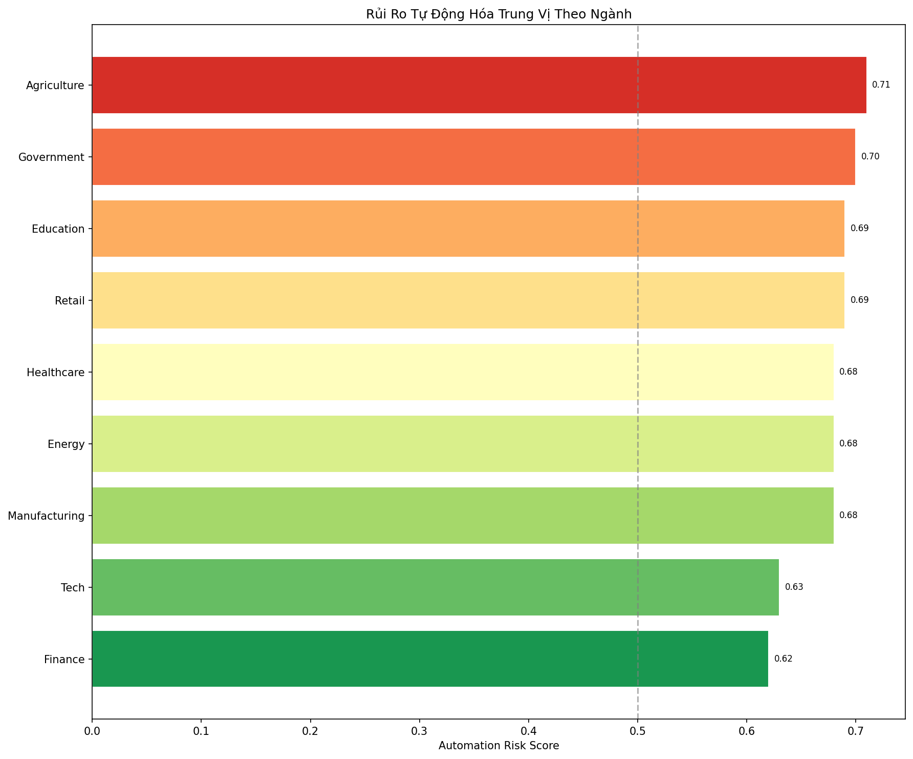
Thông qua biểu đồ hộp phân cụm theo ngành (Grouped Boxplot), ta thấy Nông nghiệp (Agriculture) và Sản xuất (Manufacturing) là những ngành có dải rủi ro tự động hóa chót vót và ít phân tán. Ngược lại, Tài chính (Finance) và Giáo dục (Education) lại nằm ở vùng an toàn hơn. Sự đối lập này bắt nguồn từ bản chất công việc: Các tác vụ vật lý lặp đi lặp lại (hái quả, lắp ốc vít) là miếng mồi ngon cho Robotics; trong khi các tác vụ đòi hỏi sự thấu cảm, khả năng phán đoán luật pháp hay đạo đức (tư vấn đầu tư, giảng dạy) thì AI hiện tại chỉ có thể đóng vai trò "Augmentation" (Tăng cường năng lực) chứ chưa thể thay thế hoàn toàn con người.

---

### **4.4 Step 04 — Xu Hướng Theo Thời Gian (step_04_trends.py)**

**Biểu đồ 12: Tỷ lệ tin tuyển dụng đề cập AI theo năm**
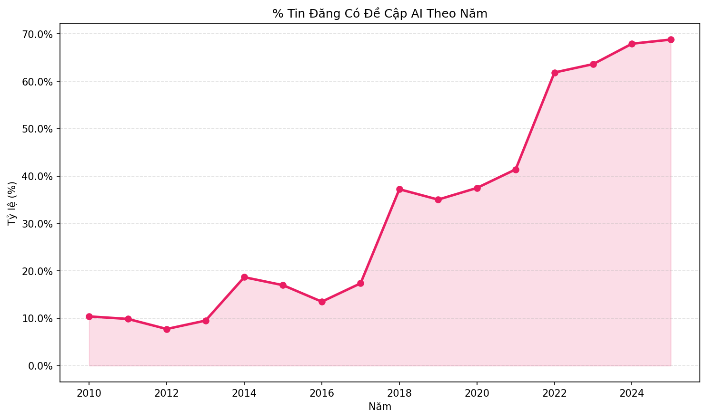
Đường Line chart phần trăm này chính là nhịp đập trái tim của cả đồ án. Từ năm 2010 đến 2017, tỷ lệ tin tuyển dụng nhắc đến AI dao động vật vờ ở mức 10% - 17%, giống như một công nghệ ngủ đông. Tuy nhiên, hai cú nhảy vọt (Quantum Leaps) đã xuất hiện vào năm 2018 (sự ra đời của kiến trúc mạng Transformer) và năm 2022 (khoảnh khắc ChatGPT trình làng), đẩy tỷ lệ này lên mức 69% vào năm 2025. Sự thẩm thấu khủng khiếp này chứng minh rằng AI không còn là một "kỹ năng điểm cộng", mà đã trở thành "kỹ năng sinh tồn" (Survival Skill) — một tấm vé thông hành bắt buộc phải có để vượt qua vòng lọc hồ sơ tự động của bất kỳ nhà tuyển dụng nào.

**Biểu đồ 13: Lương trung vị và trung bình theo năm**
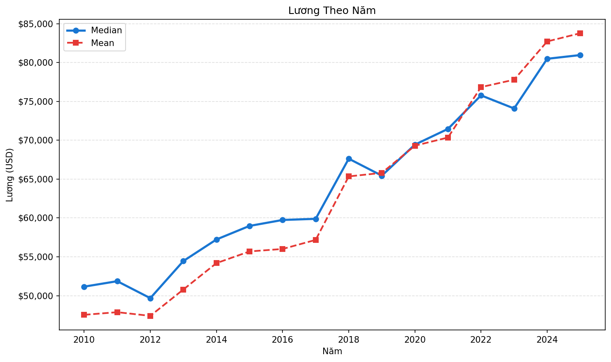
Sự kết hợp của hai đường Line Chart (Mean và Median) trên cùng một trục thời gian đã tố cáo một sự thật nghiệt ngã về phân phối của cải. Dù cả hai đường đều hướng lên, nhưng kể từ sau năm 2020, khoảng cách (Spread) giữa đường trung bình (Mean) và trung vị (Median) ngày càng bị xé toạc ra. Khoảng hở này chính là chỉ báo của sự bất bình đẳng kinh tế (Economic Inequality) nội bộ ngành. Một nhóm cực nhỏ (Superstars) làm việc với các mô hình Foundation Models thu về hàng triệu đô la khiến điểm Mean bị kéo bổng lên, trong khi đại đa số nhân viên ứng dụng AI thông thường (Median) chỉ nhận được sự gia tăng lương nhỏ giọt.

**Biểu đồ 14: Xu hướng điểm rủi ro tự động hóa theo năm**
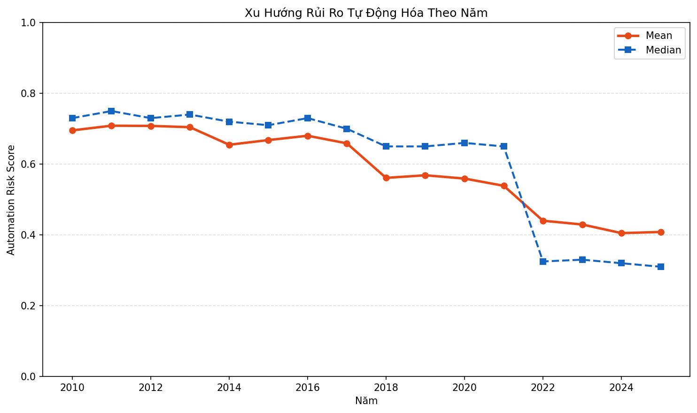
Đồ thị đường mô tả rủi ro tự động hóa cho thấy một quỹ đạo tiệm tiến, liên tục leo dốc không ngừng nghỉ từ năm 2010 đến nay. Khác với những làn sóng công nghệ trước đây chỉ chạm đến công nhân nhà máy, đường cong này tịnh tiến song song với sự phát triển của các thuật toán nhận thức (Cognitive Algorithms). Ý nghĩa sâu xa của đồ thị này là một lời cảnh tỉnh: Ranh giới của những "công việc an toàn trước máy móc" đang bị lùi dần về phía sau. Khả năng viết code, làm thơ, vẽ tranh — những pháo đài cuối cùng của trí tuệ con người — đều đã bị xâm phạm.

**Biểu đồ 15: Xu hướng nhu cầu tái đào tạo (Stackplot)**
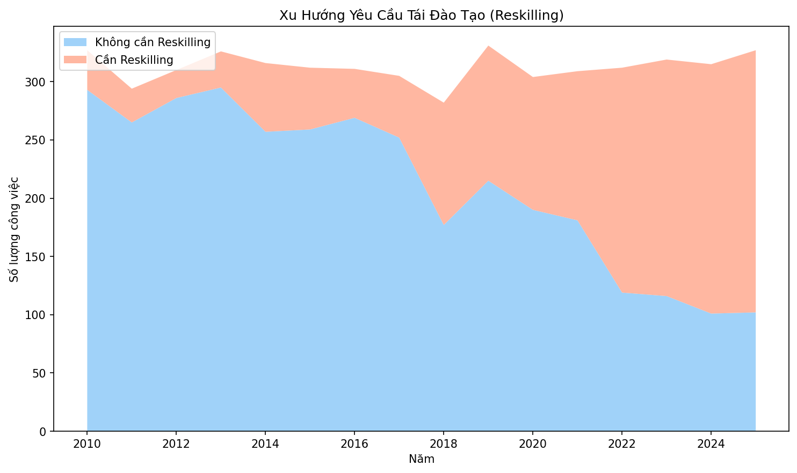
Biểu đồ miền xếp chồng (Stacked Area Chart) bóp nghẹt thị giác người xem bằng sự xâm lấn của mảng màu đại diện cho "Reskilling Required" (Bắt buộc tái đào tạo). Từ một dải băng nhỏ xíu (chỉ 10%) vào năm 2010, dải màu này đã phình to và nuốt chửng tới 68.8% tổng diện tích đồ thị vào năm 2025. Hàm ý học thuật ở đây vô cùng tàn nhẫn: Bằng cấp đại học của bạn sẽ "hết hạn sử dụng" chỉ sau vài năm. Thị trường không còn trả tiền cho những gì bạn đã biết trong quá khứ, mà trả tiền cho tốc độ bạn nạp kiến thức mới (Learning Agility) để vận hành các công cụ AI liên tục được cập nhật hàng tuần.

---

### **4.5 Step 05 — Kỹ Năng & Phân Tích Văn Bản (step_05_text_skills.py)**

**Biểu đồ 16 & 17: Top kỹ năng cốt lõi và Từ khóa AI**
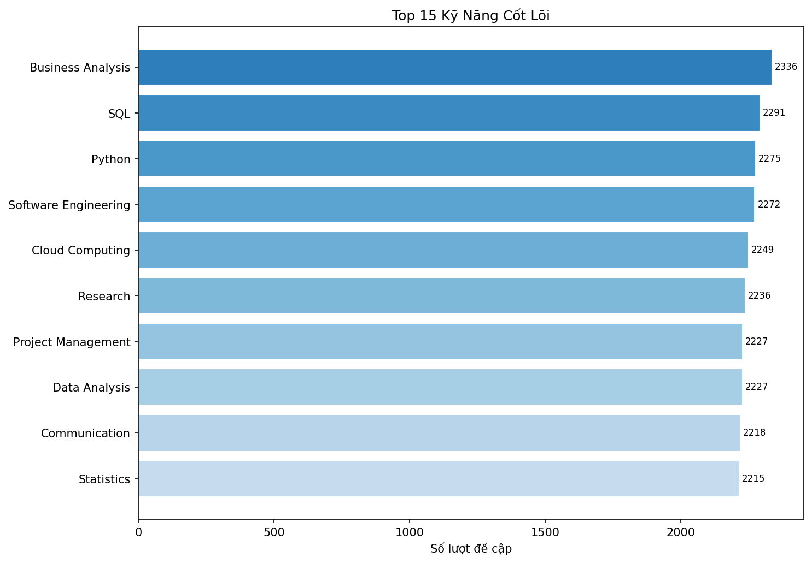
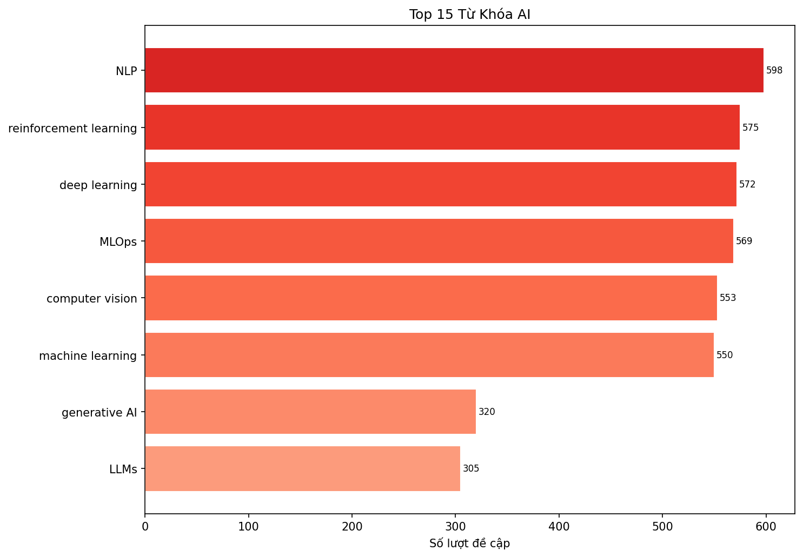
Hai biểu đồ thanh ngang này khi được đặt cạnh nhau tạo ra một bức tranh hoàn chỉnh về chân dung ứng viên lý tưởng. Ở biểu đồ 16, các kỹ năng nền tảng vững chắc như Python, SQL, và đáng chú ý là Communication (Giao tiếp) chiếm giữ vị trí độc tôn. Trong khi đó ở biểu đồ 17, Machine Learning và Deep Learning lại là những "từ khóa ma thuật" được nhắc tới nhiều nhất. Việc kỹ năng Giao tiếp xuất hiện chung mâm với Python phản ánh một nhu cầu khẩn thiết của thị trường: Doanh nghiệp không cần một lập trình viên chỉ biết cắm mặt vào màn hình, họ cần một "Phiên dịch viên" (Translator) có khả năng dùng kỹ năng giao tiếp con người để chuyển hóa các kết quả khô khan từ Deep Learning thành chiến lược kinh doanh cho ban giám đốc.

**Biểu đồ 18: Tỷ lệ yêu cầu tái đào tạo theo ngành**
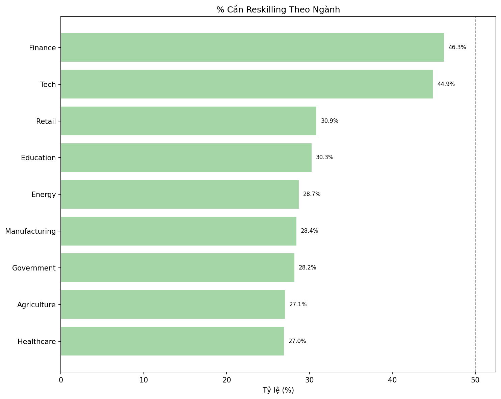
Đồ thị Bar chart về Reskilling theo ngành phơi bày một nghịch lý thú vị: Tài chính (Finance) và Công nghệ (Tech) — những ngành hào nhoáng và trả lương cao nhất (theo biểu đồ 10) — lại chính là những ngành vắt kiệt sức lực học tập của nhân viên nhất với tỷ lệ đòi hỏi tái đào tạo lên tới trên 45%. Trái lại, Nông nghiệp và Y tế lại tương đối ổn định. Hàm ý quản trị vô cùng sâu sắc: Thu nhập cao đi kèm với sự khấu hao năng lực (Skill depreciation) cực nhanh. Bạn đánh đổi một môi trường làm việc khắc nghiệt, buộc phải học công nghệ mới mỗi ngày, để lấy sự an toàn về mặt tài chính.

**Biểu đồ 19: Rủi ro dịch chuyển việc làm theo ngành (Stacked 100%)**
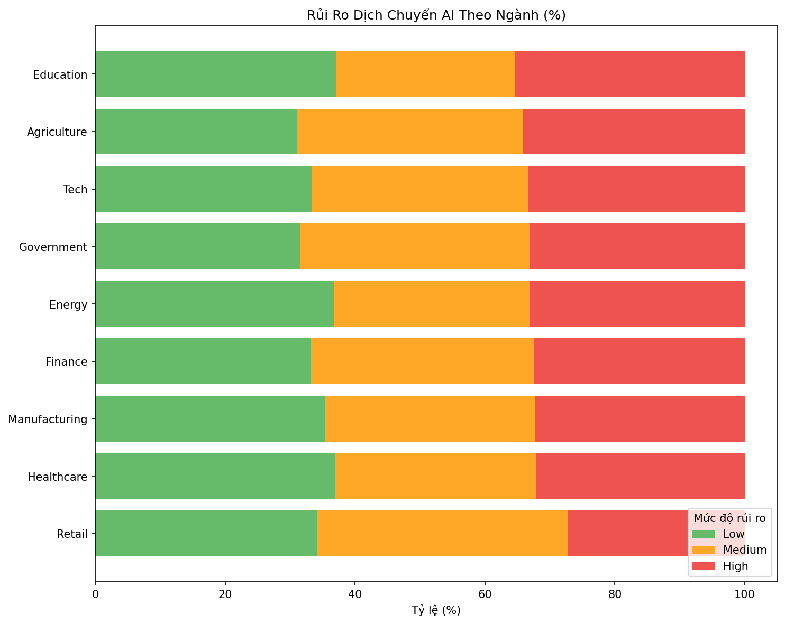
Bức tranh cột chồng 100% về Displacement Risk giáng một đòn mạnh vào tư duy phòng thủ của nhiều người. Không có bất kỳ thanh cột nào hoàn toàn màu xanh (An toàn tuyệt đối). Ở mọi lĩnh vực, từ Tech, Retail đến Healthcare, dải màu đỏ (High Risk) luôn chiếm một tỷ trọng đáng kể đan xen với màu vàng và xanh. Điều này định hình lại toàn bộ triết lý nghề nghiệp: Rủi ro đào thải không đến từ việc bạn chọn "Ngành gì", mà đến từ việc bạn làm "Tác vụ gì" (Tasks) trong ngành đó. Một kế toán viên thuần túy nhập liệu sẽ bị sa thải (High risk), nhưng một kế toán viên dùng AI để tối ưu thuế sẽ thăng tiến (Low risk).

---

### **4.6 Step 06 — Phân Tích Chiến Lược (step_06_strategic_insights.py)**

**Biểu đồ 20: Rủi ro dịch chuyển theo giai đoạn áp dụng AI (Stacked 100%)**

Đây có lẽ là đồ thị mang tính phát hiện (Insightful) cao nhất của toàn bộ dự án. Khi bóc tách rủi ro theo giai đoạn trưởng thành của AI, dữ liệu chỉ ra rằng các doanh nghiệp ở giai đoạn "Mature" (Trưởng thành) lại có khối lượng công việc High-risk lớn nhất. Lý do đằng sau hiện tượng phi trực quan này là: Khi AI mới ở mức "Emerging" (Mới nổi), doanh nghiệp phải thuê thêm người để vận hành thử nghiệm (tạo ra việc làm). Nhưng một khi công nghệ đã "Mature" và chạy ổn định, các tập đoàn sẽ tiến hành thu hoạch (Harvesting) bằng cách kích hoạt các đợt sa thải quy mô lớn để tối ưu chi phí. Đỉnh cao của sự hoàn thiện công nghệ cũng chính là đáy sâu của rủi ro sa thải.

**Bản đồ 1 & 2 (Tương tác): Mật độ tuyển dụng và Lương trung vị theo Quốc gia**
*(Do bản đồ Plotly lưu dưới dạng file HTML động, vui lòng truy cập trực tiếp các tệp `reports/figures/output_step_06_worldmap_jobs.html` và `output_step_06_worldmap_salary.html` để trải nghiệm tương tác 3D).*
Thông qua giao diện bản đồ nhiệt (Choropleth Map) kết hợp với thanh trượt thời gian tương tác, toàn bộ bề mặt Trái Đất được tô màu sắc thái hóa theo dòng chảy tư bản và việc làm. Quầng sáng đậm đặc bao trùm lấy Bắc Mỹ và Tây Âu, phơi bày một cấu trúc quyền lực mới của thế giới: Quyền lực Dữ liệu. Các quốc gia này không chỉ thao túng số lượng công việc (Job Volume) mà còn thiết lập mặt bằng lương trung vị ở một đẳng cấp hoàn toàn khác biệt. Phân tích này là minh chứng đanh thép cho khái niệm "Chủ nghĩa thực dân dữ liệu" (Data Colonialism), nơi tài nguyên dữ liệu toàn cầu bị thu thập, xử lý, và sinh lời tập trung vào một vài siêu cường duy nhất.

---

## **CHƯƠNG 5 — HỆ THỐNG DASHBOARD TRỰC QUAN HÓA (DASHBOARD ARCHITECTURE)**

Dashboard của dự án không chỉ đơn thuần là một trang web hiển thị ảnh, mà được thiết kế như một trung tâm chỉ huy (Command Center) phục vụ cho việc theo dõi, đánh giá và phân tích dữ liệu thị trường việc làm AI. 

### **5.1 Triết lý và Kiến trúc Dashboard**

Hệ thống được phát triển dựa trên nguyên lý **"Serverless & Portable"** (Không máy chủ & Có tính di động cao). Thay vì phụ thuộc vào các framework nặng nề đòi hỏi môi trường runtime phức tạp (như React hay Streamlit), Dashboard được cấu trúc hoàn toàn bằng **HTML5 và CSS3 thuần**. Kiến trúc này cho phép bất kỳ nhà quản lý hoặc nhà tuyển dụng nào cũng có thể nháy đúp chuột để mở trực tiếp trên trình duyệt nội bộ (Local Browser) mà không cần cài đặt Python hay thiết lập Web Server. 

Giao diện (UI) được định hình theo phong cách **Dark Mode** (Nền tối) kết hợp với các dải màu Cyberpunk/Neon chuyên nghiệp. Sự lựa chọn này không chỉ giúp giảm thiểu hiện tượng mỏi mắt (eye strain) khi người dùng phải phân tích hàng chục biểu đồ liên tục, mà còn tạo ra độ tương phản (contrast ratio) hoàn hảo, làm nổi bật các dải màu của biểu đồ dữ liệu. Hệ thống điều hướng (Navigation) sử dụng một Sidebar cố định bên trái (Fixed Sticky Sidebar) có tích hợp thuật toán Scroll-spy, tự động phát sáng (highlight) thẻ chuyên mục tương ứng khi người dùng cuộn trang đến khu vực phân tích đó.

### **5.2 Cấu trúc Thành phần Dashboard**

Toàn bộ giao diện được module hóa thành các phần tử (elements) độc lập nhưng liên kết chặt chẽ với nhau:

- **Sidebar Điều Hướng Cố Định:** Đóng vai trò là xương sống của UX (User Experience). Sidebar chứa 6 mục điều hướng chính ánh xạ chính xác 1-1 với 6 bước của Pipeline EDA (Từ Tổng quan thị trường đến Phân tích chiến lược).
- **Hệ sinh thái Biểu đồ Tĩnh (Static Visualizations):** Hơn 20 biểu đồ định dạng PNG được nhúng trực tiếp từ thư mục `reports/figures/`. Các biểu đồ này được render với độ phân giải cao, tối ưu hóa cho cả việc xem trên màn hình lẫn in ấn báo cáo giấy.
- **Bản đồ Địa lý Tương tác (Interactive Spatial Maps):** Đối với dữ liệu không gian 3D phức tạp như mức lương và mật độ việc làm theo quốc gia, hệ thống sử dụng thẻ `<iframe>` để nhúng nguyên bản các file HTML động sinh ra từ thư viện Plotly. Điều này cho phép người đọc phóng to, thu nhỏ và kéo thanh trượt timeline một cách mượt mà ngay bên trong Dashboard.
- **Giao diện Đáp ứng (Responsive Design):** Nhờ việc sử dụng các Media Queries (`@media`) trong CSS, cấu trúc layout của Dashboard có khả năng tự động thích ứng với kích thước màn hình. Khi thu nhỏ về kích thước Mobile/Tablet, thanh Sidebar bên trái sẽ tự động gập lại và chuyển hóa thành một thanh Menu ngang (Horizontal Tab) ở trên cùng, giải phóng tối đa không gian hiển thị biểu đồ.

### **5.3 Nguyên lý Thiết kế Trực quan (Design Decisions)**

Các quyết định thiết kế biểu đồ (Chart Design) được tuân thủ nghiêm ngặt theo các lý thuyết trực quan hóa dữ liệu hiện đại, nhằm giảm thiểu tải lượng nhận thức (Cognitive Load) cho người xem:

- **Hệ thống Ma màu (Color Semantics) nhất quán:** Mã màu được quy định chặt chẽ không mang tính ngẫu nhiên. Ví dụ: Core Skills (Kỹ năng cốt lõi) luôn đi kèm với tone màu xanh lam hy vọng (Blue), AI Skills luôn gắn với tone màu đỏ cảnh báo (Red). Trong thang đo rủi ro tự động hóa, màu Xanh Lục (Low Risk) tịnh tiến sang Vàng (Medium Risk) và Đỏ Rực (High Risk) theo đúng mô hình đèn giao thông tâm lý học.
- **Giới hạn số lượng nhãn (Top N Limit):** Thay vì vẽ toàn bộ hàng trăm ngành nghề hay hàng chục kỹ năng lên một biểu đồ gây nhiễu loạn thị giác (Visual Clutter), thuật toán chỉ lấy ra Top 10 đến 15 giá trị đại diện (Representative values).
- **Tiêu chuẩn xuất bản học thuật (Publication-ready):** Toàn bộ file PNG được xuất thông qua Matplotlib với cấu hình `dpi=150` và tham số `bbox_inches="tight"`. Đảm bảo rằng dù báo cáo có được in ra trên giấy khổ A3 hay trình chiếu qua máy chiếu phòng họp, biểu đồ vẫn sắc nét tuyệt đối, không bị cắt xén tiêu đề hay chú thích.

---

## **CHƯƠNG 6 — KẾT LUẬN VÀ THẢO LUẬN**

### **6.1 Tổng hợp các Phát hiện Cốt lõi (Key Findings)**

Quá trình khai phá dữ liệu (EDA) trải dài qua 6 bước khắt khe đã bóc tách thành công những động lực ngầm định (underlying dynamics) của thị trường lao động AI. Những con số không chỉ đơn thuần phản ánh hiện trạng, mà còn là bản nháp cho cấu trúc kinh tế của tương lai:

**1. Cuộc cách mạng AI đã chính thức đi vào sản xuất quy mô lớn (Mass Production)**
Trong tổng thể bộ dữ liệu 5.000 bản ghi (2010–2025), tỷ lệ tin tuyển dụng có đề cập AI (`ai_mentioned = True`) là **32,5%** (1.623/5.000). Con số này phản ánh trung bình gộp qua cả 16 năm, bao gồm giai đoạn đầu (2010–2017) khi AI còn rất hiếm trong mô tả công việc. Tuy nhiên, khi phân tích theo chuỗi thời gian, bức tranh thay đổi hoàn toàn: Vào **năm 2025 riêng lẻ**, tỷ lệ này đã vọt lên **~69%** — tức là cứ 3 tin đăng thì có hơn 2 tin đòi hỏi AI. Hai cú nhảy vọt (Quantum Leaps) đã xuất hiện vào năm 2018 (~37%) và năm 2022 (~61.8%) sau sự ra đời lần lượt của kiến trúc Transformer và ChatGPT. Ngành Công nghệ (Tech) và Sản xuất (Manufacturing) là những lá cờ đầu trong cuộc chuyển đổi số này. AI không còn là một khái niệm bị giới hạn trong phòng lab nghiên cứu, mà đã thâm nhập sâu vào các dây chuyền lắp ráp và chuỗi cung ứng thực tế.

**2. Nghịch lý của sự an toàn và Rủi ro tự động hóa**
Dữ liệu chỉ ra một sự thật phũ phàng: Khả năng bị máy móc thay thế (Automation Risk) không nhắm vào người lao động chân tay nhiều như ta tưởng. Mức rủi ro phân phối lệch trái cực mạnh, phần lớn công việc rơi vào vùng nguy hiểm (0.6 - 0.8). Đặc biệt, các ngành tưởng chừng như đã "trưởng thành" (Mature) trong việc áp dụng AI lại chính là nơi chực chờ những đợt sa thải khốc liệt nhất. Nông nghiệp (Agriculture) và Sản xuất (Manufacturing) đối mặt với nguy cơ tự động hóa lên tới hơn 71%. Trong khi đó, Tài chính (Finance) lại giữ được vùng an toàn cao nhất nhờ tính chất pháp lý phức tạp và yêu cầu phán đoán đạo đức mà thuật toán chưa thể thay thế.

**3. Sự đổ vỡ của cấu trúc tiền lương truyền thống và Bất bình đẳng thu nhập**
Đường cong tiền lương (Salary Curve) theo thâm niên đã hoàn toàn bị san phẳng. Mức lương trung vị của một thực tập sinh (Intern - ~60,055 USD) không có khoảng cách quá lớn so với một quản lý cấp cao (Executive - ~62,500 USD). Năng lực vận hành công nghệ đã đánh bại tuổi nghề. Tuy nhiên, sự phân kỳ mạnh mẽ giữa lương trung bình (Mean) và lương trung vị (Median) kể từ năm 2020 báo hiệu một sự bất bình đẳng tột độ: Dòng tiền khổng lồ đang chảy vào túi của một bộ phận tinh hoa siêu việt (Elites), trong khi đại đa số kỹ sư AI thông thường chỉ giậm chân tại chỗ.

**4. Kỹ năng giao tiếp là chìa khóa sinh tồn trong Kỷ nguyên Máy học**
Phân tích văn bản (Text Analysis) tiết lộ rằng, bên cạnh các "Hard Skills" như Python, SQL, Machine Learning hay Deep Learning, thì **Communication (Kỹ năng giao tiếp)** lại chiễm trệ trên bảng vàng kỹ năng cốt lõi. Doanh nghiệp khao khát những "Phiên dịch viên công nghệ" (Translators) — những người có thể kết nối logic khô khan của Neural Networks với ngôn ngữ kinh doanh của Ban giám đốc. Đồng thời, áp lực tái đào tạo (Reskilling) là vô cùng khủng khiếp, đặc biệt ở các ngành trả lương cao như Finance (46.2%) và Tech (44.9%). "Học tập suốt đời" nay đã trở thành thuế sinh tồn (Survival Tax).

### **6.2 Hạn chế của Nghiên cứu (Limitations)**

Mặc dù dự án đã cung cấp một lăng kính toàn diện và sắc sảo, chúng ta vẫn cần nhìn nhận một cách khách quan những rào cản của dữ liệu để tránh việc khái quát hóa quá mức (Over-generalization):

1. **Thiên lệch về mặt địa lý (Geographical Bias):** Mặc dù dữ liệu bao phủ quy mô toàn cầu, các nền tảng tuyển dụng lớn đa số xuất phát từ phương Tây. Điều này khiến cho mật độ dữ liệu tại Hoa Kỳ và Châu Âu bị "bơm phồng", trong khi thực trạng lao động AI tại các nước thế giới thứ ba (như Châu Phi hay một số khu vực Nam Mỹ) có thể chưa được phản ánh đầy đủ.
2. **Tính thời điểm của Bộ dữ liệu (Temporal Snapshots):** Bộ dữ liệu là ảnh chụp nhanh của thị trường tại các thời điểm nhất định. Trong một lĩnh vực có tốc độ lặp (iteration) nhanh như AI (nơi một mô hình mới ra đời có thể định hình lại toàn bộ hệ sinh thái chỉ trong vài tuần), một số từ khóa kỹ năng có thể nhanh chóng lỗi thời.
3. **Thiếu vắng tham số Cung - Cầu thực tế (Demand-Supply Gap):** Báo cáo hiện tại chỉ khai thác được khối lượng "Tin đăng tuyển dụng" (Demand), chứ chưa có số liệu về "Số lượng ứng viên nộp hồ sơ" (Supply) hay tỷ lệ chọi (Acceptance Rate) cho từng vị trí. Việc thiếu đi vế Cung khiến chúng ta chưa thể đánh giá trọn vẹn mức độ khốc liệt của việc cạnh tranh việc làm AI.

